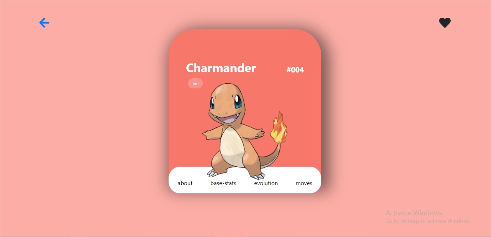
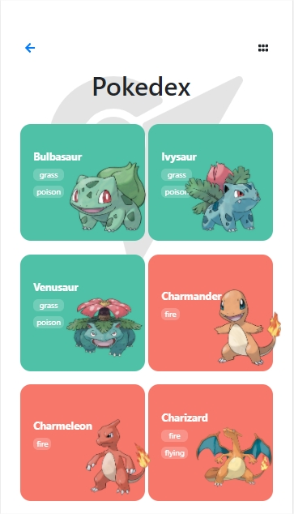

# A Pokedex made with React

## Table of Contents

- [Objective](#Objective)
- [Live Version](#LiveVersion)
- [Technologies Used](#Technologies-Used)
- [Install in Your local Machine](#Install-in-Your-local-Machine)
- [Acknowledgments](#Acknowledgments)

### Objective

The Objective was to the redux and react for filter and transform data from an external Api. In this case I chose a pokemon Api. 

In this app you could find:

- A navbar that automaticly filters a pokemon based on its ID or name.  
- A pokedex with an infinite scroller
- A nice UI design
- Routes to provide extra info

The following features are under construction:

- evolution chains 
- Moves charachteristics
- Testing
- extra filters
 

[Up](#Table-of-Contents)

### LiveVersion
Enter to (Pokedex99)[https://pokedex99.herokuapp.com/pokedex]
1. #### Screenshots Desktop App.
##### Home page

##### Search Pokemons

##### Pokemon Stats

##### Home page

2. #### Screenshots Mobile App.

##### Home page

##### Search Pokemons

##### Pokemon Stats

##### Home page

[Up](#Table-of-Contents)

### Languages and technologies used 

- React
- Redux
- JavaScript
- Babel
- ESlint
- npm
- Webpack
- HTML/SCSS
- Nodejs
- third party API

[Up](#Table-of-Contents)

### Install in Your local Machine

To run the scripts **npm** is required. To get npm you have to install [Node.js](https://nodejs.org). Follow the installation instructions for your system Mac, Linux or Windows.

Use your terminal and run the commands after each instruction.

| Command                                             | Description                                           |
| --------------------------------------------------- | ----------------------------------------------------- |
| `git clone https://github.com/nicolasmarino99/Phoom.git` | Clone the repository to you computer                  |
| `cd Phoom`                                          | Navigate to the newly created folder                  |
| `npm install`                                       | Install dependencies and launch browser with examples |
| `npm run start`                                         | Makes the build and starts the development server     |
|                                                     | Press `Ctrl + c` to kill **http-server** process      |
| `http://localhost:8080`                             | Visit this link to play the game                      |

[Up](#Table-of-Contents)

## Acknowledgements

- Saepul Nahwan for the design

[Up](#Table-of-Contents)

## Author

:man: **Nicolás Mariño Parra**

- Github: [@nicolasmarino99](https://github.com/nicolasmarino99)
- Twitter: [@nicolasmarino99](https://twitter.com/nicolasmarino99)
- Linkedin: [Nicolás Mariño Parra](https://www.linkedin.com/in/nicol%C3%A1s-mari%C3%B1o-parra-45a707177/)

## 🤝 Contributing

Contributions, issues and feature requests are welcome!

Feel free to check the [issues page](https://github.com/nicolasmarino99/Phoom.git/issues).

1. Fork it (https://github.com/nicolasmarino99/Phoom.git/fork)
2. Create your feature branch (git checkout -b my-new-feature)
3. Commit your changes (git commit -am 'Add some feature')
4. Push to the branch (git push origin my-new-feature)
5. Create a new Pull Request

## Show your support

Give a ⭐️ if you enjoyed this project!

## 📝 License

This project is [MIT](lic.url) licensed.
